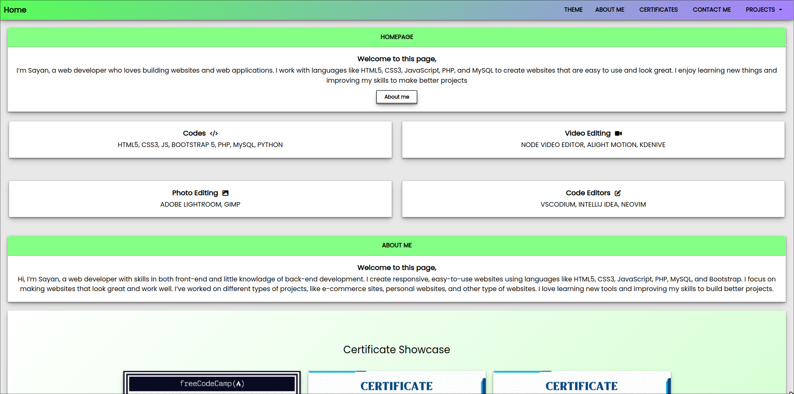
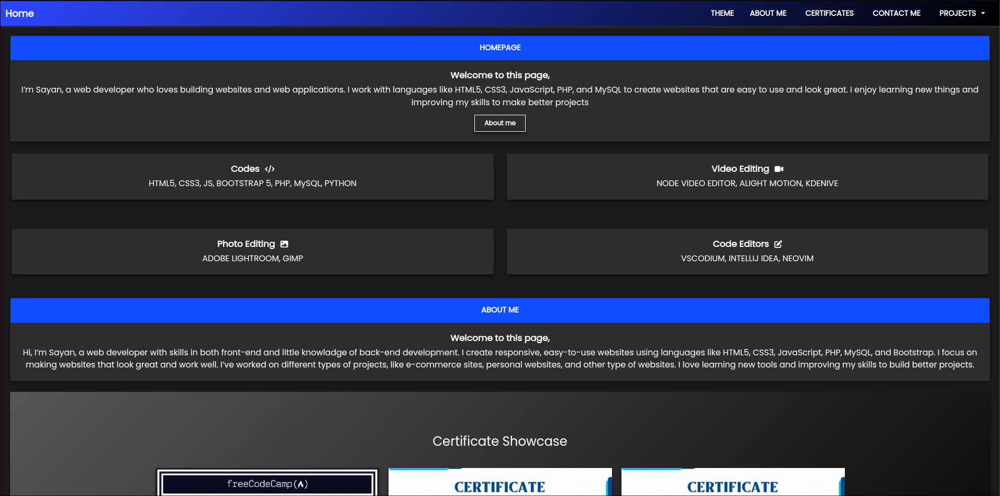
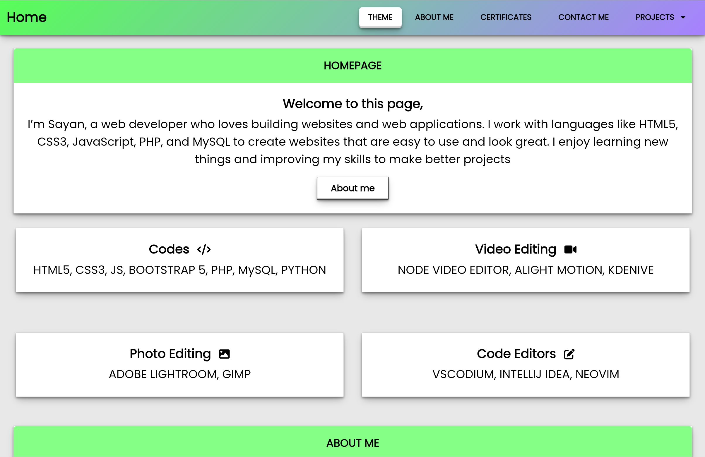
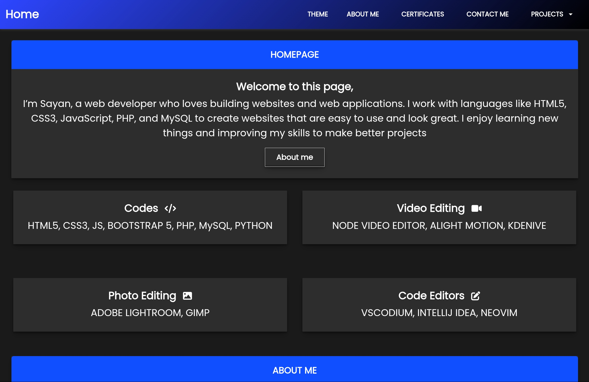
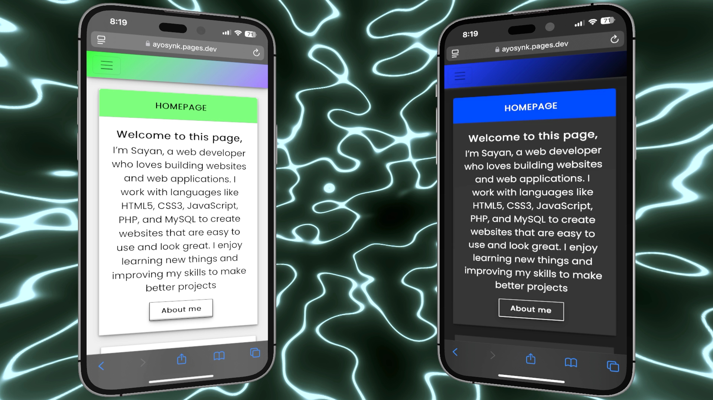

# Portfolio Website

This is a professional portfolio website designed to showcase projects and skills. It features a modern, responsive design with both **dark** and **light** themes, ensuring a seamless user experience across all devices. Feel free to explore, use, or customize this project for your own needs.

---

## Features
- **Loader**: A loading before opening the website.
- **working Contact me**: even though it is a static website. using [Web3forms](web3forms.com) you can use the contact me form (Get in Touch section) in this.

- **Dual Themes**: Switch between **dark** and **light** modes for a personalized viewing experience.
- **Responsive Design**: Optimized for **desktop**, **tablet**, and **mobile** devices.
- **Clean and Modern UI**: A clean, user-friendly interface that highlights your work effectively.

---

## Preview

### Desktop View
- **Light Mode**  
  <div></div>

  - **Dark Mode**  
    <div></div>

    ### Tablet View
    - **Light Mode**  
      <div></div>

      - **Dark Mode**  
        <div></div>

        ### Mobile View
        - **Light/Dark Mode**  
          <div></div>

          ---

          ## How to Use

          1. Clone the repository:
             ```bash
                git clone https://github.com/synkfr/portfolio-v2.git
                   ```
                   2. Open the project in your preferred code editor.
                   3. Customize the content, themes, or styles as needed.
                   4. Deploy the website to your preferred hosting platform.

                   ---

                   ## License

                   This project is open-source and available under the [MIT License](LICENSE). Feel free to use, modify, and distribute it as you see fit.
